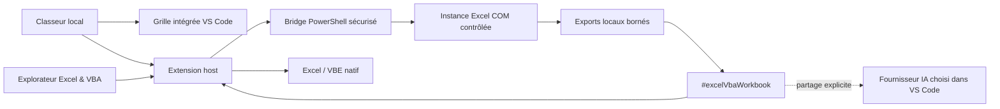

<p align="center">
  
</p>

<h1 align="center">Excel AI & VBA Studio</h1>

<p align="center">
  <strong>Excel dans Visual Studio Code, avec un contexte de classeur contrôlé pour l’IA.</strong>
</p>

<p align="center">
  <a href="https://github.com/StephaneSGL/excel-ai-vba-studio/actions/workflows/main.yml"></a>
  
  
  <a href="LICENSE"></a>
</p>

Visualisez et modifiez les formats sûrs dans VS Code, inspectez à la demande les valeurs, formules et métadonnées d’un classeur, puis ouvrez le véritable Microsoft Excel ou le VBE lorsque vous avez besoin du ruban complet, de Power Query, des compléments, des macros ou des outils Développeur.

*View and edit safe spreadsheet formats in VS Code, expose bounded workbook context to AI on demand, and hand advanced operations off to native Microsoft Excel or the Visual Basic Editor.*

> [!IMPORTANT]
> La grille intégrée n’est pas une réimplémentation complète de Microsoft Excel. Le ruban Excel, Power Query, les compléments, les outils de données avancés, les macros et le VBE restent fournis par l’application Microsoft Excel installée.

## Fonctionnalités actuelles

| Format | Dans VS Code | Excel natif | Contexte IA |
| --- | --- | --- | --- |
| `.xlsx` | Lecture et édition | Oui | Oui |
| `.csv`, `.tsv` | Lecture et édition | Oui | Oui |
| `.xlsm`, `.xls` | Lecture seule protégée | Édition, ruban et VBA | Oui |
| `.xlsb` | Pas de rendu intégré | Oui | Oui |

- Grille de classeur directement dans un onglet VS Code.
- Explorateur **Excel & VBA** dans la barre latérale.
- Ouverture du fichier actif dans Microsoft Excel avec son interface complète.
- Accès direct au mode Développeur et au Visual Basic Editor.
- Export local borné en Markdown et JSON : valeurs, formules, formats, tableaux, graphiques, noms, liens, validations, commentaires, connexions et métadonnées VBA autorisées.
- Outil IA référençable `#excelVbaWorkbook`, exécuté uniquement à la demande.
- Aucune télémétrie de l’extension et aucune clé API gérée par l’extension.

## Installation

### Depuis un VSIX

Téléchargez un fichier `excel-ai-vba-studio-win32-x64-<version>.vsix`, puis exécutez :

```powershell
code --install-extension .\excel-ai-vba-studio-win32-x64-<version>.vsix
```

Vous pouvez aussi utiliser **Extensions → … → Installer à partir d’un fichier VSIX** dans VS Code.

### Depuis les sources

Prérequis de construction : Node.js 22, npm, Git et Visual Studio Code 1.95 ou version ultérieure.

```powershell
git clone https://github.com/StephaneSGL/excel-ai-vba-studio.git
cd excel-ai-vba-studio
npm ci
npm run validate
npm run package
```

Le Marketplace Visual Studio n’est pas encore publié. Le dépôt GitHub public reste pour l’instant la source officielle.

## Démarrage en 60 secondes

1. Ouvrez un fichier pris en charge dans VS Code.
2. Utilisez la grille intégrée ou l’explorateur **Excel & VBA**.
3. Exportez un contexte local si vous souhaitez l’inspecter.
4. Dans un chat IA compatible avec les outils de modèle VS Code, référencez explicitement `#excelVbaWorkbook`.
5. Basculez vers Microsoft Excel ou le VBE pour les fonctions natives avancées.

### Commandes principales

| Commande | Fonction |
| --- | --- |
| `Excel AI & VBA Studio : Ouvrir dans Microsoft Excel` | Ouvre le classeur actif dans Excel natif. |
| `Excel AI & VBA Studio : Ouvrir Excel en mode Développeur / VBA` | Ouvre Excel et affiche l’environnement Développeur/VBE. |
| `Excel AI & VBA Studio : Exporter le contexte du classeur` | Produit les exports Markdown et JSON locaux. |
| `Excel AI & VBA Studio : Exporter et copier le contexte` | Exporte puis copie un contexte borné. |
| `Excel AI & VBA Studio : Exporter et révéler les sources VBA` | Révèle les fichiers VBA quand la stratégie Excel l’autorise. |
| `Excel AI & VBA Studio : Nettoyer les exports générés` | Supprime les exports contrôlés par l’extension. |

Raccourcis :

- `Ctrl+Alt+E` : ouvrir dans Microsoft Excel ;
- `Ctrl+Alt+F11` : ouvrir le mode Développeur / VBA.

### Paramètres

| Paramètre | Défaut | Rôle |
| --- | ---: | --- |
| `excelAiVbaStudio.maxRows` | `200` | Nombre maximal de lignes exportées par feuille. |
| `excelAiVbaStudio.maxColumns` | `50` | Nombre maximal de colonnes exportées par feuille. |
| `excelAiVbaStudio.includeVba` | `false` | Inclut le code VBA uniquement si Excel l’autorise explicitement. |

## Architecture



Le bundle publié démarre dans `src/extension.ts` et n’enregistre que les surfaces Excel/VBA/IA prévues. Le dépôt conserve des sources historiques du projet d’origine qui ne sont pas incluses dans le VSIX ciblé.

## Sécurité Excel, VBA et IA

- L’export utilise une instance Excel dédiée et refuse de poursuivre si l’exécution des macros ne peut pas être désactivée.
- Les événements, la mise à jour des liens et le calcul automatique sont désactivés pendant l’analyse contrôlée.
- L’extension ne modifie jamais le paramètre **Trust access to the VBA project object model** du Centre de gestion de la confidentialité Excel.
- `.xlsm` et `.xls` ne sont jamais réécrits par la grille intégrée.
- Les exports sont locaux, limités en taille et supprimables.
- Le contenu du classeur est traité comme une donnée non fiable, pas comme une instruction pour l’IA.
- Aucun classeur n’est transmis automatiquement à un fournisseur IA.

Ce mécanisme ne constitue pas un bac à sable réseau : Microsoft Excel, Windows, des compléments installés ou des logiciels de sécurité peuvent avoir leurs propres comportements réseau.

Consultez [SECURITY.md](SECURITY.md) et [PRIVACY.md](PRIVACY.md) avant d’utiliser de vrais classeurs professionnels.

## Limites de la Preview

- Windows x64 uniquement.
- Microsoft Excel desktop est requis pour Excel natif, COM, VBA et les anciens formats.
- Les classeurs protégés, corrompus ou restreints par une politique d’entreprise peuvent ne fournir qu’un contexte partiel.
- L’accès au code source VBA dépend de la politique du Centre de gestion de la confidentialité Excel.
- Le ruban Excel complet n’est pas reproduit dans VS Code ; il est ouvert dans Excel natif.

## Feuille de route

- enrichir progressivement l’expérience de grille et son accessibilité ;
- améliorer les surfaces Formules, Données et Développeur dans VS Code ;
- étendre les classeurs synthétiques et les tests de non-régression ;
- préserver le VBA avant toute future édition intégrée des formats macro ;
- compléter la localisation française et anglaise ;
- préparer les mises à jour Marketplace après configuration du Publisher.

La feuille de route exprime une direction et ne constitue pas une promesse de date ou de fonctionnalité.

## Développement et contribution

```powershell
npm ci
npm run validate
```

Les classeurs de test doivent être entièrement synthétiques. N’envoyez jamais de données d’entreprise, d’identifiants, de secrets ou de code VBA propriétaire.

- Bugs reproductibles : [GitHub Issues](https://github.com/StephaneSGL/excel-ai-vba-studio/issues)
- Questions et idées : [GitHub Discussions](https://github.com/StephaneSGL/excel-ai-vba-studio/discussions)
- Vulnérabilités : [signalement privé GitHub](https://github.com/StephaneSGL/excel-ai-vba-studio/security/advisories/new)
- Règles de contribution : [CONTRIBUTING.md](CONTRIBUTING.md)

## Licence et propriété

Ce dépôt est **public et source-available**, mais il n’est pas « open source » au sens de l’Open Source Initiative.

- Les contributions et modifications propres à **Excel AI & VBA Studio**, distribuées à partir de la version `0.1.1`, sont proposées sous la [PolyForm Noncommercial License 1.0.0](LICENSE). Leur exploitation commerciale nécessite une autorisation écrite séparée de StephaneSGL.
- Les portions provenant d’**Office Viewer** par Weijan Chen restent disponibles sous leur licence MIT d’origine.
- Chaque dépendance tierce conserve sa propre licence.
- Les versions ou commits déjà distribués sous MIT conservent les droits qui avaient déjà été accordés ; un changement de licence ne peut pas révoquer ces droits antérieurs.

La répartition complète est expliquée dans [LICENSING.md](LICENSING.md). Les mentions obligatoires sont conservées dans [NOTICE.md](NOTICE.md), [LICENSES/OFFICE-VIEWER-MIT.txt](LICENSES/OFFICE-VIEWER-MIT.txt) et [THIRD_PARTY_NOTICES.md](THIRD_PARTY_NOTICES.md).

Microsoft, Visual Studio, Visual Studio Code, Excel et VBA sont des marques de leurs propriétaires respectifs. Ce projet indépendant n’est ni publié ni approuvé par Microsoft.
