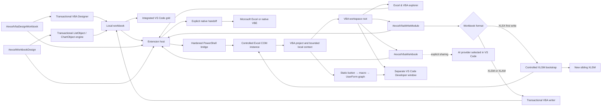

<p align="center">
  
</p>

<h1 align="center">Excel AI & VBA Studio</h1>

<p align="center">
  <strong>Work with Excel workbooks, VBA projects, and bounded AI context directly in Visual Studio Code.</strong>
</p>

<p align="center">
  <a href="https://github.com/StephaneSGL/excel-ai-vba-studio/actions/workflows/main.yml"></a>
  
  
  <a href="LICENSE"></a>
</p>

Excel AI & VBA Studio is a preview VS Code extension for inspecting supported spreadsheet formats, editing safe workbook content, and working with Excel objects, VBA modules, classes, and UserForms without leaving VS Code.

> [!IMPORTANT]
> The workbook grid and VBA Studio are integrated into VS Code. Microsoft Excel does not open merely because a workbook is viewed or exported. The explicit **Open in Excel** and **Open native VBE** commands launch or reactivate Excel only when requested.

## Current capabilities

| Format | Workbook grid | VBA workspace | Bounded AI context |
| --- | --- | --- | --- |
| `.xlsx` | Read and edit | Working project without embedded macros | Yes |
| `.csv`, `.tsv` | Read and edit | Not applicable | Yes |
| `.xlsm` | Targeted cell and formatting editing | Yes, when Excel policy allows it | Yes |
| `.xls` | Protected read-only view | Yes, when Excel policy allows it | Yes |
| `.xlsb` | No integrated grid | Yes, when Excel policy allows it | Yes |

- Workbook grid in a VS Code editor tab.
- Theme colors, conditional formatting, comments, and worksheet protection preserved in `.xlsx` workbooks.
- Integrated A4 print preview, conditional indicators, and structured-formula results.
- **Excel & VBA Project** explorer with **Microsoft Excel Objects**, **UserForms**, **Modules**, **Class Modules**, and **References**.
- VBA properties pane synchronized with the selected component.
- Integrated **VBA Studio** with project explorer, properties, code, procedures, and supported component creation.
- Light, dark, and high-contrast themes synchronized with the active VS Code theme.
- `.bas`, `.cls`, and `.frm` editing in VS Code, including an interactive, non-executing preview for exported UserForms.
- VBA workspace root and generated `.github/copilot-instructions.md` so GitHub Copilot can index exported sources.
- Automatic transactional reinjection when supported `.bas`, `.cls`, or existing `.frm` code is saved.
- Standard-module and class creation from VBA Studio or GitHub Copilot.
- Targeted `.xlsm` value, formula, cell-style, explicit row/column dimension, and supported conditional-formatting editing through an isolated Excel working copy, with conflict detection, persistent backup, and atomic replacement.
- Real Excel tables are preserved as `ListObject` instances. Multiple disjoint tables may use the same columns, with independent names, filters, stripes, and built-in styles. Existing totals rows are inventoried and preserved, but native creation, totals transitions, and resizing a table that already has totals are refused because Excel would move cells and rewrite formula references.
- The Insert ribbon includes a native chart designer for the complete published `XlChartType` catalog, editable series, source ranges, axes, titles, legends, labels, colours, markers, and layout.
- Automated creation is offline by default: `xlSuggestedChart` is inventory-only and `xlRegionMap` is disabled because Excel may send geographic data to Bing Maps; existing map charts are preserved.
- Classic OOXML charts are reloaded into the designer; modern `chartEx` objects are detected and preserved natively, with an explicit non-editable count when their richer OOXML cannot be mapped safely.
- Explicit handoff to the real workbook in Microsoft Excel or its native VBE.
- Bounded local Markdown and JSON exports for values, formulas, formats, tables, charts, names, links, validations, comments, connections, and permitted VBA metadata.
- Referencable AI tools `#excelVbaWorkbook`, `#excelVbaWriteModule`, `#excelVbaDesignWorkbook`, and `#excelWorkbookDesign`, invoked only on request.
- First-time `.bas` or `.cls` write-back for an `.xlsx` creates a new sibling `.xlsm`, preserves the original byte-for-byte, and returns the exact target path for subsequent writes.
- `#excelVbaDesignWorkbook` creates complete UserForms with real designer/`.frx` streams, adds supported visual controls, and creates worksheet Form Control buttons assigned to macros in an existing `.xlsm`.
- The VBA Controls view inventories worksheet Form Control buttons and ActiveX controls, resolves their public macro targets, and displays a static button-to-macro-to-UserForm flow without running VBA.
- Existing Form Control buttons can be reassigned, and supported worksheet ActiveX buttons can be created or bound to verified macros through the transactional VBA Designer.
- VBA Studio includes a visual UserForm canvas backed by the real COM designer inventory. Standard controls can be added, moved, resized, inspected, and connected to complete VBA event procedures.
- GitHub Copilot can use `updateUserFormControl` and `setUserFormEventHandler` through `#excelVbaDesignWorkbook`, including parameterized events such as `KeyDown`, `BeforeUpdate`, and `QueryClose`.
- GitHub Copilot can create, update, and delete native tables and charts through `#excelWorkbookDesign` in `.xlsx` and `.xlsm` workbooks, with the same transactional safeguards as the integrated editor.
- **Open VBA Studio in VS Code** creates an isolated, validated VBA workspace in a separate VS Code window and opens the integrated studio there.
- A read-only **Enterprise Security Center** classifies the selected workbook as restricted, managed, standard, or unknown and explains file, macro/VBA, ActiveX, Protected View, Trusted Location, signature, EFS/OOXML package encryption, Microsoft 365 Cloud Policy, Windows policy, Intune/MDM, and local Microsoft Purview signals.
- No extension telemetry and no API key management by the extension.

## Install from a VSIX

Download `excel-ai-vba-studio-win32-x64-<version>.vsix`, then run:

```powershell
code --install-extension .\excel-ai-vba-studio-win32-x64-<version>.vsix
```

You can also use **Extensions > ... > Install from VSIX** in VS Code.

## Build from source

Requirements: Node.js 22, npm, Git, and Visual Studio Code 1.95 or newer.

```powershell
git clone https://github.com/StephaneSGL/excel-ai-vba-studio.git
Set-Location excel-ai-vba-studio
npm ci
npm run validate
npm run package
```

The Visual Studio Marketplace release is not available yet. This public repository is currently the official source for the preview.

## Quick start

1. Open a supported workbook in VS Code.
2. Use the integrated grid or the **Excel & VBA** explorer.
3. Open the **Enterprise Security Center** before using an unfamiliar or organization-managed workbook.
4. Export local context only when you need to inspect it.
5. Reference `#excelVbaWorkbook` explicitly from a compatible VS Code AI chat.
6. Use **Open VBA Studio in VS Code** to open a separate Developer window containing the project, controls graph, and real exported sources.
7. Edit and save a supported `.bas`, `.cls`, or existing `.frm` file. For `.xlsx`, the first `.bas`/`.cls` write creates a sibling `.xlsm`; continue on the returned target. Existing macro-enabled workbooks use validated transactional replacement.
8. Reference `#excelVbaDesignWorkbook` to create a UserForm, add or reposition supported controls, assign complete control/UserForm event procedures, create or reassign a worksheet Form Control button, or create/bind a permitted worksheet ActiveX control in an existing `.xlsm`.
9. Use the Insert ribbon or reference `#excelWorkbookDesign` to create and edit native tables and charts. See [the complete choices and limits](docs/CHARTS-AND-TABLES.md).

### What changes inside XLSX and XLSM

- The first standard module or class applied to an `.xlsx` is inserted through a controlled hidden Excel instance into a new sibling `.xlsm`. The `.xlsx` source is never rewritten.
- A standard module or class created in VBA Studio can be inserted into the `.xlsm` VBA project.
- Existing UserForm code can be updated. Its designer and `.frx` resources remain unchanged and are verified before write-back.
- The separate VBA Designer tool can create a complete UserForm with real designer/`.frx` streams, add or reposition supported controls, assign bounded event procedures, create or reassign a worksheet Form Control button, and create/bind permitted worksheet ActiveX controls.
- Supported standard controls are Label, TextBox, CommandButton, ComboBox, ListBox, CheckBox, OptionButton, ToggleButton, Frame, Image, SpinButton, and ScrollBar.
- UserForm controls can be added, moved, resized, and connected to VBA events on the visual VS Code canvas. Button flows remain a static simulation; **Open in Excel** provides the real clickable controls and macro events.
- Existing UserForms, controls, buttons, ActiveX data, VBA, and opaque OOXML parts are preserved during targeted cell edits.
- Native table/chart transactions accept `.xlsx` and `.xlsm`, create a persistent recovery copy, and verify the requested objects after reopening the working copy in Excel. Workbook opening itself remains package-only and does not start Excel.
- **Open in Excel** opens the real workbook. **Open native VBE** opens Excel and its separate VBA editor. **Open VBA Studio in VS Code** opens a separate VS Code Developer window.

### Main commands

| Command ID | Purpose |
| --- | --- |
| `excelAiVbaStudio.openExcel` | Launches or reactivates the real workbook only on request. |
| `excelAiVbaStudio.openVbe` | Opens the workbook in Excel, then displays the native VBE. |
| `excelAiVbaStudio.openSecurityCenter` | Inspects local file and Office security signals without opening Excel or changing policy. |
| `excelAiVbaStudio.openVbaDeveloper` | Opens a separate validated VS Code Developer window with the VBA interface and exported sources. |
| `excelAiVbaStudio.exportWorkbook` | Creates local Markdown and JSON exports. |
| `excelAiVbaStudio.copyWorkbookContext` | Exports and copies bounded workbook context. |
| `excelAiVbaStudio.openVbaExplorer` | Opens `.bas`, `.cls`, and `.frm` files and exposes them to Copilot. |
| `excelAiVbaStudio.askCopilotAboutWorkbook` | Prepares Copilot Chat with `#excelVbaWorkbook` and the active workbook. |
| `excelAiVbaStudio.cleanExports` | Removes exports managed by the extension. |

Shortcut:

- `Ctrl+Alt+F11`: open VBA Studio in VS Code.

### Settings

| Setting | Default | Purpose |
| --- | ---: | --- |
| `excelAiVbaStudio.maxRows` | `200` | Maximum exported rows per worksheet. |
| `excelAiVbaStudio.maxColumns` | `50` | Maximum exported columns per worksheet. |
| `excelAiVbaStudio.includeVba` | `false` | Includes VBA only when Excel explicitly permits programmatic access. |
| `excelAiVbaStudio.allowedCustomActiveXProgIds` | `[]` | Exact allowlist for third-party ActiveX ProgIDs; built-in MSForms controls do not need an entry. |

## Architecture



The published bundle starts from `src/extension.ts` and registers only the intended Excel, VBA, and AI surfaces. The repository retains historical upstream sources that are not included in the targeted VSIX.

## Excel, VBA, and AI security

- Workbook export uses a dedicated Excel instance and fails closed if macro execution cannot be disabled.
- The Enterprise Security Center is opt-in and read-only. It inspects the selected file, its Mark of the Web, bounded Office 16 policy/preference registry locations, Cloud Policy presence, declared Trusted Locations, Office architecture, fixed Intune/MDM and Group Policy signals, and the enterprise rule that allows or refuses user-defined Trusted Locations, without starting Excel.
- Detected values are separated by technical source: Microsoft 365 Cloud Policy, Windows policy registry for the computer or user, or local preference. The effective table applies `Cloud Policy > Windows policy > local preference`, shows shadowed evidence, and marks effective managed decisions as locked. A Windows policy key alone cannot prove whether GPO, Intune/MDM, Configuration Manager, or a script delivered it.
- The Center can refresh or copy its local report, open the extension settings, and expose contextual links to Microsoft 365 Apps, Intune, Purview, or GPO diagnostics for an already authorized administrator. It deliberately does not open the inspected workbook; Excel must be started separately before consulting **Developer > Macro Security**. Opening a portal grants no role. The extension never changes Group Policy, Intune, Cloud Policy, Purview, Trust Center, AccessVBOM, ActiveX, Trusted Locations, Mark of the Web, or the registry.
- Modern OPC `LabelInfo.xml` and correctly related historical custom properties are parsed structurally. Any stored technical name, tenant ID, method, date, and content-marking bits are shown as unauthenticated local declarations; they do not establish the current display name, confidentiality rank, tenant authenticity, or encryption state.
- `unknown` means that the final Excel decision cannot be proven from local static evidence. Cloud assignment, certificate trust, antivirus decisions, and policy conflicts can still require confirmation by an administrator or by Excel itself.
- Events, link updates, alerts, and automatic calculation are disabled during controlled analysis.
- The extension never changes Excel's **Trust access to the VBA project object model** setting or the Windows registry.
- First-time `.xlsx` VBA bootstrap requires that the user has already enabled Excel's VBA project object-model access. It uses a hidden, owned Excel process with macros disabled, creates only the exact sibling `.xlsm`, verifies `vbaProject.bin`, and leaves the source hash unchanged.
- Any path containing the exact `.excel-ai-vba-backups` component is refused as a write target because it is reserved for recovery copies.
- `.xls` is never rewritten by the integrated grid.
- Supported `.xlsm` cell edits are sent to a dedicated Excel instance operating on a working copy, never directly on the original file.
- Before committing an `.xlsm` edit, the engine checks source hashes, the OOXML package, `vbaProject.bin`, UserForms, controls, ActiveX data, and opaque resources; it keeps the displaced original in `.excel-ai-vba-backups`.
- A row or column resize that would move a protected worksheet control or drawing is refused with an explicit message instead of weakening the VML/opaque-part integrity check.
- VBA write-back operates on a copy, validates workbook and source hashes, creates a backup, then replaces the workbook atomically.
- The source-only VBA writer still refuses UserForm designer changes. The separate VBA Designer accepts bounded visual operations only in an existing `.xlsm`, refuses signed or protected projects, and verifies the resulting designer streams before atomic replacement.
- Worksheet ActiveX creation is denied unless Excel itself permits insertion. Third-party ProgIDs are additionally denied unless the exact value is already present in the user-owned allowlist.
- The direct `.xlsm`/`.xlam` source writer does not start Excel. The `.xlsx` bootstrap and `.xlsm` Designer use controlled hidden Excel processes with macros disabled; none of these paths runs a macro or changes AccessVBOM.
- Exports remain local, size-bounded, and removable.
- An OOXML package signature makes the workbook read-only in the extension. Detection follows the OPC digital-signature origin/signature relationships and effective Content Types, including arbitrary valid part URIs; malformed, orphaned, external, or otherwise ambiguous signature metadata fails closed. Grid saves, Save As, VBA bootstrap/write-back, UserForms, worksheet buttons, and ActiveX all refuse the mutation rather than invalidate that signature.
- Workbook content is treated as untrusted data, not as instructions for an AI model.
- No workbook is sent to an AI provider automatically.

This is not a network sandbox: Microsoft Excel, Windows, installed add-ins, and security software may have their own network behavior. Read [SECURITY.md](SECURITY.md) and [PRIVACY.md](PRIVACY.md) before using real professional workbooks.

Microsoft references: [Cloud Policy for Microsoft 365 Apps](https://learn.microsoft.com/en-us/microsoft-365-apps/admin-center/overview-cloud-policy), [Microsoft Intune](https://learn.microsoft.com/en-us/mem/intune/fundamentals/what-is-intune), [Purview sensitivity labels in Office](https://learn.microsoft.com/en-us/purview/sensitivity-labels-office-apps), [Sensitivity Label Information Part](https://learn.microsoft.com/en-us/openspecs/office_standards/ms-oi29500/c0599e21-b77f-475e-99e0-bd647f60bcbb), [macros from the Internet](https://learn.microsoft.com/en-us/microsoft-365-apps/security/internet-macros-blocked), [Trusted Locations](https://learn.microsoft.com/en-us/microsoft-365-apps/security/trusted-locations), and [Excel macro security](https://support.microsoft.com/en-US/Excel/change-macro-security-settings-in-excel).

## Preview limitations

- Windows x64 only.
- Microsoft Excel desktop is currently required for COM-based VBA extraction, legacy formats, and targeted `.xlsm` cell editing.
- Protected, corrupted, or enterprise-restricted workbooks may provide only partial context.
- VBA source access depends on the Excel Trust Center policy already configured by the user.
- Creating the first VBA module in `.xlsx` also depends on that preconfigured Trust Center policy; the extension never enables it.
- UserForm and button creation requires an existing local `.xlsm`, Excel desktop, and VBA project-object-model access already enabled by the user. Signed and protected VBA projects are refused.
- The interactive VS Code preview simulates control state only and never runs event procedures; real VBA behavior remains an explicit action inside native Excel.
- Integrated `.xlsm` editing supports values, formulas, cell styles, explicit row heights and column widths, the five conditional-formatting presets exposed by the ribbon, and native worksheet tables/charts through their dedicated designers. Worksheet structure, implicit dimension resets, merges, unsupported/PivotChart objects, controls, buttons, existing-rule edits, rule reordering, and partial rule deletion are refused.
- The visual UserForm designer supports the standard-control toolbox, positioning, sizing, core properties, and event procedures. Nested-container editing, z-order, font/color styling, images, multi-selection, copy/paste, and native VBE parity remain future work.
- Excel or enterprise policy can block ActiveX insertion even when the extension request is valid. The extension reports that refusal and never weakens Trust Center settings automatically.
- The Security Center does not authenticate to Microsoft 365, resolve current sensitivity-label display names or their tenant-defined rank, validate certificate trust chains, parse encrypted/legacy CFB LabelInfo streams, diagnose every legacy XLS encryption scheme, attribute a Windows policy value to GPO versus Intune, or replace Intune, Group Policy Results, Microsoft 365 Apps admin center, Defender, or Purview auditing.

## Version history

| Version | Summary |
| --- | --- |
| `0.5.1` | Fixes worksheet button verification after Excel normalizes `OnAction` casing and keeps raw export JSON out of progress notifications. |
| `0.5.0` | Adds the visual UserForm canvas, native form/control inventory, control positioning and property updates, plus bounded complex VBA event assignment for Copilot and the visual editor. |
| `0.4.0` | Adds the worksheet Controls view, static button-to-macro-to-UserForm graph, Form Control reassignment, permitted ActiveX creation/binding, and a separate VS Code Developer window. It also fixes false `.xlsm` `worksheet-features` save refusals caused by grid hydration. |
| `0.3.0` | Introduced real UserForm designer/`.frx` creation, 12 standard controls, worksheet Form Control creation, and broader native formatting edits. These operations are transactional and verified against a live Excel copy. |
| `0.2.1` | Added first-write `.xlsx` to sibling `.xlsm` conversion for new standard modules and classes. It preserved the source and returned the exact target path for subsequent writes. |
| `0.2.0` | Added transactional VBA write-back and targeted native `.xlsm` cell/style editing. It also completed save, revert, backup, and hot-exit protection for the embedded grid. |
| `0.1.7` | Activated advanced ribbon data, formula, formatting, import, chart, and page-layout actions. It removed the remaining visible placeholder actions. |
| `0.1.6` | Reduced initial webview JavaScript from about 2 MB to 219 KB through progressive loading. It also removed redundant workbook parsing and traversal. |
| `0.1.5` | Synchronized the spreadsheet and VBA Studio with VS Code light, dark, and high-contrast themes. It improved focus, selection, warning, and status styling. |
| `0.1.4` | Added the VBE-style integrated editor, real VBA source files, module/class creation, and Copilot workspace indexing. It stabilized the generated VBA directory on Windows. |
| `0.1.3` | Added high-fidelity colors, conditional formatting, comments, protection, project exploration, properties, and UserForm preview. It also improved print preview and structured-formula display. |
| `0.1.1` | Added the Excel-style ribbon and its core editing/navigation commands. It established public documentation, licensing, notices, and contribution rules. |
| `0.1.0` | Established the Windows x64 Excel/CSV editor, native Excel/VBE handoff, bounded workbook export, VBA explorer, and AI read tool. It removed unrelated viewers, telemetry, and sponsor integrations from the packaged extension. |

## Roadmap

- Improve grid fidelity and accessibility.
- Expand the visual UserForm designer with nested containers, z-order, styling, multi-selection, and copy/paste.
- Expand the integrated Formula, Data, and Developer surfaces.
- Add synthetic workbooks and regression coverage for unsupported macro and formatting cases.
- Complete English and French localization.
- Prepare Marketplace updates after publisher configuration.

The roadmap states direction, not a release date or feature promise.

## Development and contribution

```powershell
npm ci
npm run validate
```

Test workbooks must be fully synthetic. Never submit company data, credentials, secrets, or proprietary VBA.

- Reproducible bugs: [GitHub Issues](https://github.com/StephaneSGL/excel-ai-vba-studio/issues)
- Questions and ideas: [GitHub Discussions](https://github.com/StephaneSGL/excel-ai-vba-studio/discussions)
- Vulnerabilities: [private GitHub reporting](https://github.com/StephaneSGL/excel-ai-vba-studio/security/advisories/new)
- Contribution rules: [CONTRIBUTING.md](CONTRIBUTING.md)

## License and ownership

This repository is **public and source-available**, but it is not open source under the Open Source Initiative definition.

Excel AI & VBA Studio-specific contributions distributed from version `0.1.1` use the [PolyForm Noncommercial License 1.0.0](LICENSE):

| Use | Permission |
| --- | --- |
| Personal study, research, experiments, hobbies, and amateur projects without an anticipated commercial application | Permitted |
| Education, charitable work, public research, public safety or health, environmental protection, and government use covered by PolyForm | Permitted |
| Modify or redistribute for a permitted noncommercial purpose while preserving required notices | Permitted |
| Use in business operations, paid client work, resale, monetization, or integration into a commercial product or service | Separate written commercial license required |

- Portions originating from **Office Viewer** by Weijan Chen remain available under their original MIT license.
- Every third-party dependency retains its own license.
- Versions or commits already distributed under MIT retain the rights previously granted; a later license change cannot revoke those earlier rights.

See [LICENSING.md](LICENSING.md) for the plain-language summary and complete allocation. Required notices remain in [NOTICE.md](NOTICE.md), [LICENSES/OFFICE-VIEWER-MIT.txt](LICENSES/OFFICE-VIEWER-MIT.txt), and [THIRD_PARTY_NOTICES.md](THIRD_PARTY_NOTICES.md).

Microsoft, Visual Studio, Visual Studio Code, Excel, and VBA are trademarks of their respective owners. This independent project is not published or endorsed by Microsoft.
