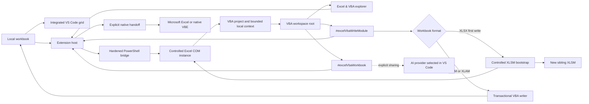

<p align="center">
  
</p>

<h1 align="center">Excel AI & VBA Studio</h1>

<p align="center">
  <strong>Work with Excel workbooks, VBA projects, and bounded AI context directly in Visual Studio Code.</strong>
</p>

<p align="center">
  <a href="https://github.com/StephaneSGL/excel-ai-vba-studio/actions/workflows/main.yml"></a>
  
  
  <a href="LICENSE"></a>
</p>

Excel AI & VBA Studio is a preview VS Code extension for inspecting supported spreadsheet formats, editing safe workbook content, and working with Excel objects, VBA modules, classes, and UserForms without leaving VS Code.

> [!IMPORTANT]
> The workbook grid and VBA Studio are integrated into VS Code. Microsoft Excel does not open merely because a workbook is viewed or exported. The explicit **Open in Excel** and **Open native VBE** commands launch or reactivate Excel only when requested.

## Current capabilities

| Format | Workbook grid | VBA workspace | Bounded AI context |
| --- | --- | --- | --- |
| `.xlsx` | Read and edit | Working project without embedded macros | Yes |
| `.csv`, `.tsv` | Read and edit | Not applicable | Yes |
| `.xlsm` | Targeted cell and formatting editing | Yes, when Excel policy allows it | Yes |
| `.xls` | Protected read-only view | Yes, when Excel policy allows it | Yes |
| `.xlsb` | No integrated grid | Yes, when Excel policy allows it | Yes |

- Workbook grid in a VS Code editor tab.
- Theme colors, conditional formatting, comments, and worksheet protection preserved in `.xlsx` workbooks.
- Integrated A4 print preview, conditional indicators, and structured-formula results.
- **Excel & VBA Project** explorer with **Microsoft Excel Objects**, **UserForms**, **Modules**, **Class Modules**, and **References**.
- VBA properties pane synchronized with the selected component.
- Integrated **VBA Studio** with project explorer, properties, code, procedures, and supported component creation.
- Light, dark, and high-contrast themes synchronized with the active VS Code theme.
- `.bas`, `.cls`, and `.frm` editing in VS Code, including an interactive, non-executing preview for exported UserForms.
- VBA workspace root and generated `.github/copilot-instructions.md` so GitHub Copilot can index exported sources.
- Automatic transactional reinjection when supported `.bas`, `.cls`, or existing `.frm` code is saved.
- Standard-module and class creation from VBA Studio or GitHub Copilot.
- Targeted `.xlsm` value, formula, cell-style, explicit row/column dimension, and supported conditional-formatting editing through an isolated Excel working copy, with conflict detection, persistent backup, and atomic replacement.
- Explicit handoff to the real workbook in Microsoft Excel or its native VBE.
- Bounded local Markdown and JSON exports for values, formulas, formats, tables, charts, names, links, validations, comments, connections, and permitted VBA metadata.
- Referencable AI tools `#excelVbaWorkbook`, `#excelVbaWriteModule`, and `#excelVbaDesignWorkbook`, invoked only on request.
- First-time `.bas` or `.cls` write-back for an `.xlsx` creates a new sibling `.xlsm`, preserves the original byte-for-byte, and returns the exact target path for subsequent writes.
- `#excelVbaDesignWorkbook` creates complete UserForms with real designer/`.frx` streams, adds supported visual controls, and creates worksheet Form Control buttons assigned to macros in an existing `.xlsm`.
- No extension telemetry and no API key management by the extension.

## Install from a VSIX

Download `excel-ai-vba-studio-win32-x64-<version>.vsix`, then run:

```powershell
code --install-extension .\excel-ai-vba-studio-win32-x64-<version>.vsix
```

You can also use **Extensions > ... > Install from VSIX** in VS Code.

## Build from source

Requirements: Node.js 22, npm, Git, and Visual Studio Code 1.95 or newer.

```powershell
git clone https://github.com/StephaneSGL/excel-ai-vba-studio.git
Set-Location excel-ai-vba-studio
npm ci
npm run validate
npm run package
```

The Visual Studio Marketplace release is not available yet. This public repository is currently the official source for the preview.

## Quick start

1. Open a supported workbook in VS Code.
2. Use the integrated grid or the **Excel & VBA** explorer.
3. Export local context only when you need to inspect it.
4. Reference `#excelVbaWorkbook` explicitly from a compatible VS Code AI chat.
5. Use **Open VBA Studio in VS Code** to inspect the project and its real source files.
6. Edit and save a supported `.bas`, `.cls`, or existing `.frm` file. For `.xlsx`, the first `.bas`/`.cls` write creates a sibling `.xlsm`; continue on the returned target. Existing macro-enabled workbooks use validated transactional replacement.
7. Reference `#excelVbaDesignWorkbook` to create a UserForm, add supported controls, or place a worksheet Form Control button in an existing `.xlsm`.

### What changes inside XLSX and XLSM

- The first standard module or class applied to an `.xlsx` is inserted through a controlled hidden Excel instance into a new sibling `.xlsm`. The `.xlsx` source is never rewritten.
- A standard module or class created in VBA Studio can be inserted into the `.xlsm` VBA project.
- Existing UserForm code can be updated. Its designer and `.frx` resources remain unchanged and are verified before write-back.
- The separate VBA Designer tool can create a complete UserForm with real designer/`.frx` streams, add supported controls to a new or existing UserForm, and create a worksheet Form Control button with an `OnAction` macro assignment.
- Supported standard controls are Label, TextBox, CommandButton, ComboBox, ListBox, CheckBox, OptionButton, ToggleButton, Frame, Image, SpinButton, and ScrollBar.
- UserForm controls can be exercised visually in the VS Code preview without running VBA; **Open in Excel** provides the real clickable controls and macro events.
- Existing UserForms, controls, buttons, ActiveX data, VBA, and opaque OOXML parts are preserved during targeted cell edits.
- **Open in Excel** opens the real workbook. **Open native VBE** opens Excel and its separate VBA editor. **VBA Studio** remains a VS Code editor tab.

### Main commands

| Command ID | Purpose |
| --- | --- |
| `excelAiVbaStudio.openExcel` | Launches or reactivates the real workbook only on request. |
| `excelAiVbaStudio.openVbe` | Opens the workbook in Excel, then displays the native VBE. |
| `excelAiVbaStudio.openVbaDeveloper` | Opens the integrated VBA interface and real exported sources. |
| `excelAiVbaStudio.exportWorkbook` | Creates local Markdown and JSON exports. |
| `excelAiVbaStudio.copyWorkbookContext` | Exports and copies bounded workbook context. |
| `excelAiVbaStudio.openVbaExplorer` | Opens `.bas`, `.cls`, and `.frm` files and exposes them to Copilot. |
| `excelAiVbaStudio.askCopilotAboutWorkbook` | Prepares Copilot Chat with `#excelVbaWorkbook` and the active workbook. |
| `excelAiVbaStudio.cleanExports` | Removes exports managed by the extension. |

Shortcut:

- `Ctrl+Alt+F11`: open VBA Studio in VS Code.

### Settings

| Setting | Default | Purpose |
| --- | ---: | --- |
| `excelAiVbaStudio.maxRows` | `200` | Maximum exported rows per worksheet. |
| `excelAiVbaStudio.maxColumns` | `50` | Maximum exported columns per worksheet. |
| `excelAiVbaStudio.includeVba` | `false` | Includes VBA only when Excel explicitly permits programmatic access. |

## Architecture



The published bundle starts from `src/extension.ts` and registers only the intended Excel, VBA, and AI surfaces. The repository retains historical upstream sources that are not included in the targeted VSIX.

## Excel, VBA, and AI security

- Workbook export uses a dedicated Excel instance and fails closed if macro execution cannot be disabled.
- Events, link updates, alerts, and automatic calculation are disabled during controlled analysis.
- The extension never changes Excel's **Trust access to the VBA project object model** setting or the Windows registry.
- First-time `.xlsx` VBA bootstrap requires that the user has already enabled Excel's VBA project object-model access. It uses a hidden, owned Excel process with macros disabled, creates only the exact sibling `.xlsm`, verifies `vbaProject.bin`, and leaves the source hash unchanged.
- Any path containing the exact `.excel-ai-vba-backups` component is refused as a write target because it is reserved for recovery copies.
- `.xls` is never rewritten by the integrated grid.
- Supported `.xlsm` cell edits are sent to a dedicated Excel instance operating on a working copy, never directly on the original file.
- Before committing an `.xlsm` edit, the engine checks source hashes, the OOXML package, `vbaProject.bin`, UserForms, controls, ActiveX data, and opaque resources; it keeps the displaced original in `.excel-ai-vba-backups`.
- A row or column resize that would move a protected worksheet control or drawing is refused with an explicit message instead of weakening the VML/opaque-part integrity check.
- VBA write-back operates on a copy, validates workbook and source hashes, creates a backup, then replaces the workbook atomically.
- The source-only VBA writer still refuses UserForm designer changes. The separate VBA Designer accepts bounded visual operations only in an existing `.xlsm`, refuses signed or protected projects, and verifies the resulting designer streams before atomic replacement.
- The direct `.xlsm`/`.xlam` source writer does not start Excel. The `.xlsx` bootstrap and `.xlsm` Designer use controlled hidden Excel processes with macros disabled; none of these paths runs a macro or changes AccessVBOM.
- Exports remain local, size-bounded, and removable.
- Workbook content is treated as untrusted data, not as instructions for an AI model.
- No workbook is sent to an AI provider automatically.

This is not a network sandbox: Microsoft Excel, Windows, installed add-ins, and security software may have their own network behavior. Read [SECURITY.md](SECURITY.md) and [PRIVACY.md](PRIVACY.md) before using real professional workbooks.

## Preview limitations

- Windows x64 only.
- Microsoft Excel desktop is currently required for COM-based VBA extraction, legacy formats, and targeted `.xlsm` cell editing.
- Protected, corrupted, or enterprise-restricted workbooks may provide only partial context.
- VBA source access depends on the Excel Trust Center policy already configured by the user.
- Creating the first VBA module in `.xlsx` also depends on that preconfigured Trust Center policy; the extension never enables it.
- UserForm and button creation requires an existing local `.xlsm`, Excel desktop, and VBA project-object-model access already enabled by the user. Signed and protected VBA projects are refused.
- The interactive VS Code preview simulates control state only and never runs event procedures; real VBA behavior remains an explicit action inside native Excel.
- Integrated `.xlsm` editing supports values, formulas, cell styles, explicit row heights and column widths, appending the five conditional-formatting presets exposed by the ribbon, and clearing all rules on one sheet. Worksheet structure, implicit dimension resets, merges, objects, controls, buttons, existing-rule edits, rule reordering, and partial rule deletion are refused.
- There is no drag-and-drop UserForm designer inside VS Code yet. Visual creation is exposed through the bounded AI tool; worksheet button creation currently targets Form Controls, not ActiveX controls.

## Roadmap

- Improve grid fidelity and accessibility.
- Expand the integrated Formula, Data, and Developer surfaces.
- Add synthetic workbooks and regression coverage for unsupported macro and formatting cases.
- Complete English and French localization.
- Prepare Marketplace updates after publisher configuration.

The roadmap states direction, not a release date or feature promise.

## Development and contribution

```powershell
npm ci
npm run validate
```

Test workbooks must be fully synthetic. Never submit company data, credentials, secrets, or proprietary VBA.

- Reproducible bugs: [GitHub Issues](https://github.com/StephaneSGL/excel-ai-vba-studio/issues)
- Questions and ideas: [GitHub Discussions](https://github.com/StephaneSGL/excel-ai-vba-studio/discussions)
- Vulnerabilities: [private GitHub reporting](https://github.com/StephaneSGL/excel-ai-vba-studio/security/advisories/new)
- Contribution rules: [CONTRIBUTING.md](CONTRIBUTING.md)

## License and ownership

This repository is **public and source-available**, but it is not open source under the Open Source Initiative definition.

- Excel AI & VBA Studio-specific contributions distributed from version `0.1.1` are offered under the [PolyForm Noncommercial License 1.0.0](LICENSE). Commercial use requires separate written permission from StephaneSGL.
- Portions originating from **Office Viewer** by Weijan Chen remain available under their original MIT license.
- Every third-party dependency retains its own license.
- Versions or commits already distributed under MIT retain the rights previously granted; a later license change cannot revoke those earlier rights.

See [LICENSING.md](LICENSING.md) for the complete allocation. Required notices remain in [NOTICE.md](NOTICE.md), [LICENSES/OFFICE-VIEWER-MIT.txt](LICENSES/OFFICE-VIEWER-MIT.txt), and [THIRD_PARTY_NOTICES.md](THIRD_PARTY_NOTICES.md).

Microsoft, Visual Studio, Visual Studio Code, Excel, and VBA are trademarks of their respective owners. This independent project is not published or endorsed by Microsoft.
